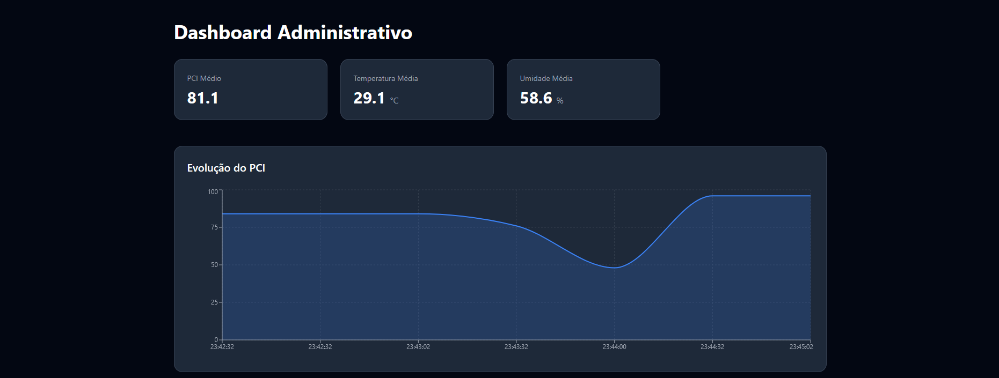
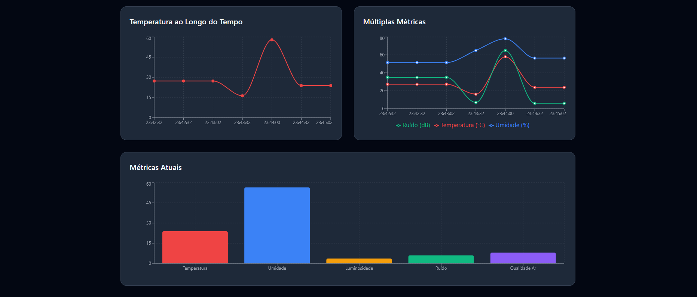
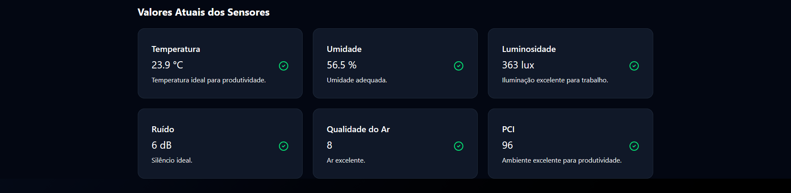

<div align="center">
  <h1>PRODSENSE</h1>
</div>

<div align="center">
  
</div>

## Sistema IoT de Monitoramento Ambiental integrado com Inteligência Artifical para Produtividade

## 🧠 Descrição do Projeto

O **ProdSense** é um sistema IoT inteligente para monitorar condições ambientais de ambientes corporativos — temperatura, umidade, ruído, luminosidade e qualidade do ar — enviando tudo em tempo real via MQTT para uma API FIWARE.
Com apoio de **Inteligência Artificial embarcada**, o sistema calcula o **Índice de Conforto Produtivo** indicando automaticamente o quão adequado está o ambiente para o trabalho.


🔗 **Simulação completa no Wokwi:**  
👉 [Clique aqui para visualizar o projeto](https://wokwi.com/projects/447703879792623617)

---

## 🎯 O Problema:

Ambientes corporativos sofrem com fatores que prejudicam o desempenho:
- 💡 Iluminação inadequada
- 🌡️ Temperatura desconfortável 
- 💧 Umidade fora do recomendado
- 💨 Qualidade do ar ruim 
- 🔊 Ruído excessivo
- 📉 Falta de acompanhamento em tempo real

Esses elementos reduzem foco, aumentam estresse e diminuem produtividade.

## 💡 A Solução:
O ProdSense monitora continuamente todas as variáveis relevantes, calcula o PCI (Produtivity Comfort Index) de 0 a 100 e indica:
- se o ambiente está confortável
- se há risco à saúde
- se ajustes simples podem melhorar a produtividade

Integração com dashboard web permite visualização em tempo real, histórico e recomendações inteligentes.

--- 

## ⚙️ Funcionalidades

- 📡 Conexão automática com **Wi-Fi** e **broker MQTT**  
- 🌡️ Leitura de **temperatura e umidade (DHT22)**  
- 💡 Monitoramento de **luminosidade (LDR)** 
- 🔊 Monitoramento acústico (sensor de som)
- 💨 Qualidade do ar via MQ-135
- 🧠 Cálculo de PCI usando IA embarcada(lógica simulada que interpreta faixas e gera um cálculo de PCI)
- 📊 Dashboard com gráficos, histórico e análises
- 🔄 Atualização em tempo real
- 🏢 Dashboard administrativo completo

---

## 🛠️ Tecnologias Utilizadas

### 🖥️ Front-end
- React + Vite
- Recharts → Gráficos interativos
- Lucide React → Icones
- Tailwind CSS → Estilização responsiva

### Backend/Hardware
- ESP32 → Microcontrolador principal
- DHT22 → Sensor de temperatura e umidade
- LDR → Sensor de luminosidade
- Sensor MQ-135 - Qualidade do ar
- Sensor de Som - Níveis de ruído
- MQTT → Protocolo de comunicação
- FIWARE Orion Context Broker → Gerenciamento de entidades IoT

---

## 📡 Diagrama do Fluxo MQTT
```
                 +-------------------+
                 |      Sensores     |
                 | DHT22 / LDR / MQ  |
                 +---------+---------+
                           |
                           | Dados brutos
                           v
                   +-------+--------+
                   |     ESP32      |
                   |                |
                   +-------+--------+
                           |
                           | Publica via MQTT
                           v
               +-----------+-----------+
               |      Broker MQTT      |
               |     (porta 1883)      |
               +-----------+-----------+
                           |
                           | Assinatura FIWARE (/attrs)
                           v
           +---------------+----------------+
           |     FIWARE Orion Context       |
           |       (porta 1026)             |
           +---------------+----------------+
                           |
                           | Dados normalizados
                           v
                +----------+----------+
                |      Dashboard      |
                |   React + Recharts  |
                +----------------------+

```

### 📤 Publicação (Publish)

| Tópico | Dado Enviado |
|--------|---------------|
| `/TEF/device111/attrs/l` | Luminosidade (lux) |
| `/TEF/device111/attrs/t` | Temperatura (°C) |
| `/TEF/device111/attrs/h` | Umidade (%) |
| `/TEF/device111/attrs/n` | Ruído (dB) |
| `/TEF/device111/attrs/a` | Qualidade do ar |
| `/TEF/device111/attrs/p` | PCI (0–100) |

**FIWARE** — Porta 1026

- Entity: `urn:ngsi-ld:device111`

 - Atributos:
  `luminosity`, `temperature`, `humidity`, `airquality`, `noise`, `pci`
---

## 📊 6. Tabelas de Classificação dos Sensores

### 💡 Luminosidade (LUX)
| Estado    | Faixa               | Impacto             |
| --------- | ------------------- | ------------------- |
| Excelente | 350–650             | Ideal               |
| Bom       | 200–350 ou 650–800  | Adequado            |
| Moderado  | 100–200 ou 800–1200 | Pode causar cansaço |
| Ruim      | 20–100 ou 1200–5000 | Ajustes necessários |
| Crítico   | ≤20 ou >5000        | Prejudicial         |


### 🌡️ Temperatura (°C)
| Estado    | Faixa          | Impacto                    |
| --------- | -------------- | -------------------------- |
| Excelente | 22–24          | Ideal                      |
| Bom       | 20–22 ou 24–26 | Confortável                |
| Moderado  | 18–20 ou 26–28 | Pequeno impacto            |
| Ruim      | 16–18 ou 28–30 | Desconfortável             |
| Crítico   | <16 ou >30     | Necessário ajuste imediato |


### 💧 Umidade (%)
| Estado    | Faixa          | Impacto                    |
| --------- | -------------- | -------------------------- |
| Excelente | 22–24          | Ideal                      |
| Bom       | 20–22 ou 24–26 | Confortável                |
| Moderado  | 18–20 ou 26–28 | Pequeno impacto            |
| Ruim      | 16–18 ou 28–30 | Desconfortável             |
| Crítico   | <16 ou >30     | Necessário ajuste imediato |


### 🔊 Ruído (dB)
| Estado    | Faixa | Impacto            |
| --------- | ----- | ------------------ |
| Excelente | ≤20   | Silêncio ideal     |
| Bom       | ≤40   | Adequado           |
| Moderado  | ≤60   | Moderado           |
| Ruim      | ≤80   | Prejudicial        |
| Crítico   | >80   | Afeta concentração |


### 💨 Qualidade do Ar 
| Estado    | Faixa | Impacto    |
| --------- | ----- | ---------- |
| Excelente | ≤10   | Excelente  |
| Bom       | ≤25   | Bom        |
| Moderado  | ≤50   | Moderado   |
| Ruim      | ≤75   | Ruim       |
| Crítico   | >75   | Muito ruim |

### 🧮 7. PCI – Índice de Conforto Produtivo

| Estado    | Faixa  | Impacto              |
| --------- | ------ | -------------------- |
| Excelente | 90–100 | Produtividade ideal  |
| Bom       | 75–89  | Confortável          |
| Moderado  | 60–74  | Atenção necessária   |
| Ruim      | 40–59  | Prejudica foco       |
| Crítico   | 0–39   | Ambiente prejudicial |


🔍 Recomendações automáticas incluem:

- *“Ambiente excelente. Produtividade ideal.”*

- *“Ambiente prejudicial: ajustar luz, temperatura ou ruído.”*

---

## 🚀 Como Executar

### ✅ Passo 1 — Acesse o projeto online
Abra o simulador no Wokwi:  
🔗 [https://wokwi.com/projects/447703879792623617](https://wokwi.com/projects/447703879792623617)

### ✅ Passo 2 — Configure o Wi-Fi e Broker MQTT:
O código já utiliza o Wi-Fi padrão do Wokwi:
```
const char* default_SSID = "Wokwi-GUEST";
const char* default_PASSWORD = ""
```
🌐 Configuração do Servidor:
```
const char* BROKER_MQTT = "3.85.188.98";
const int BROKER_PORT = 1883;
```
**Nota sobre o servidor**:
O broker MQTT 3.85.188.98 é um servidor de demonstração temporário que pode não estar sempre disponível<br>
Alternativa: broker.hivemq.com (não atualiza dashboard web).

✅ Passo 3 — Inicie a simulação

Clique em “Start Simulation” no wokwi

### Front-end 
### 🔹 1. Clonar o repositório
```bash
git clone [url-repositorio]
cd prodsense
```
### 🔹 2. Instalar as Dependências

```bash
npm install

```
### 🔹 3. Executar o Servidor JSON 

```bash
json-server --watch db.json --port 3001
```

### 🔹 4. Rodar o Projeto React

```bash
npm run dev
```


## 📸 Screenshots do Sistema


*Interface principal mostrando monitoramento contínuo dos sensores e recomendações*



*Interface do admin com metricas, graficos, e monitoramento continuo*

## 🎥 10. Vídeo explicativo
🔗 [YouTube]()

👥 Autores

Equipe:
Ana Clara Rocha de Oliveira – RM: 564298<br>
Davi Marques de Andrade Munhoz – RM: 566223<br>
Matheus von koss wildeisen - RM: 561539<br>

